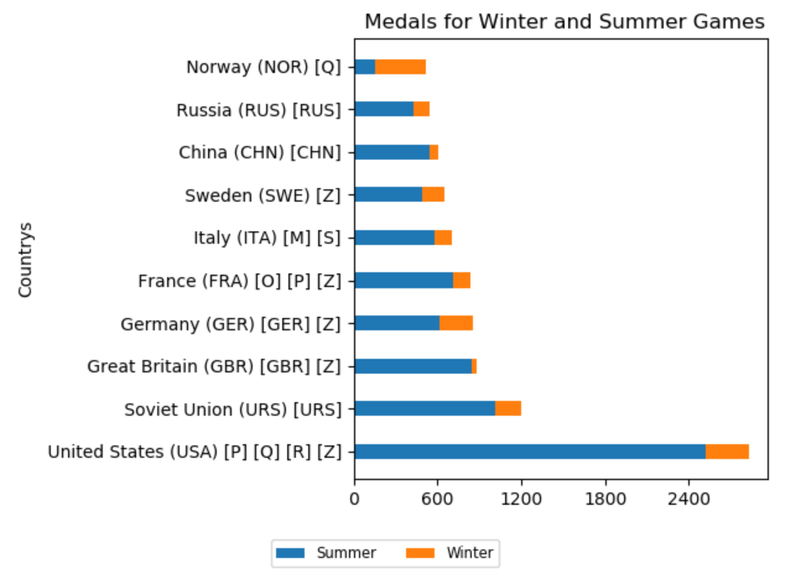
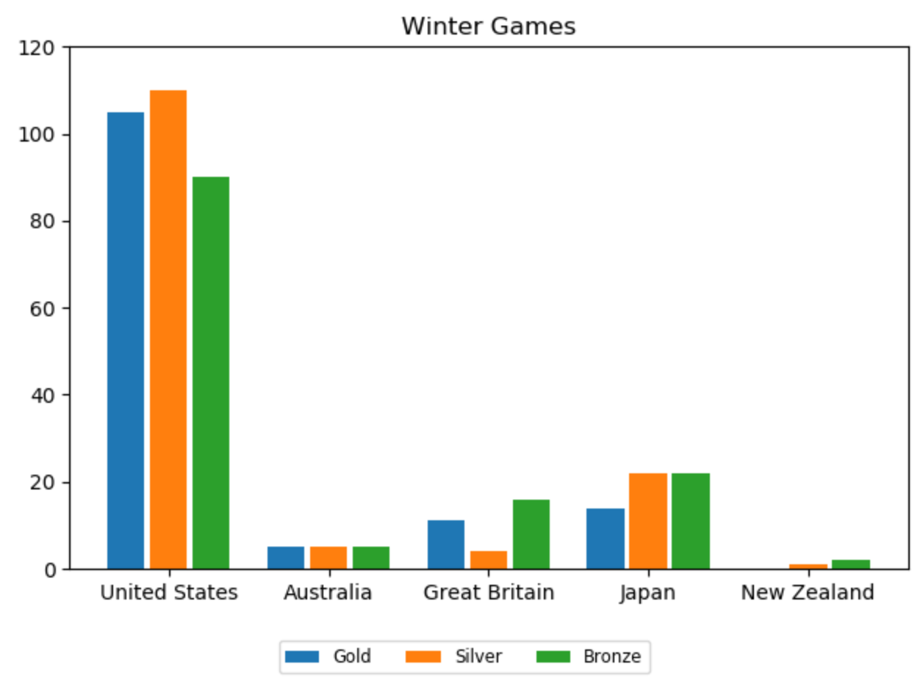

# mmatplotlib.pyplot
- import the moodule

~~~

- import matplotlib.pyplot as plt

plt.plot([1,2,3],[3,2,1])
plt.show()
~~~

常用笔记

plt.tight_layout()   // 自动缩进边距

plot          //线
bar，barh     //柱状
scatter       //散点

-----------

## plot()
- plot(*args, **kwargs)
  - plot([x],y,[fmt], data= NOne,**kwargs)
  - plot([x], y, [fmt], [x2], y2, [fmt2], ..., **kwargs)

--------------

- You can use Line2D properties as keyword arguments for more control on the appearance.
Line properties and fmt can be mixed. The following two calls yield identical results

-'go--' as same as  color='green', marker='o', linestyle='dashed'

~~~~

>>> plot(x, y, 'go--', linewidth=2, markersize=12)
>>> plot(x, y, color='green', marker='o', linestyle='dashed',
        linewidth=2, markersize=12)
        
~~~~

---------------

- **Plotting labelled data**

All indexable objects are supported. This could e.g. be a dict, a pandas.DataFame or a structured numpy array
~~~~

obj={'xlabel':[1,2,3,4],'ylabel':[1,2,3,4]}

plot('xlabel', 'ylabel', data=obj)

~~~~

--------------

- **multiple sets of data**

  1. using plot() multiple times 
  pyplot 对于这个对象 相当于 plot() 就是一次绘制
  ~~~

  >>> plot([1,2,3,4],[3,4,None,None],'g')

  >>> plot([1,2,3,4,5,6],[1,4,None,None,5,6],'r')
  ~~~
  
  --------------
  
  2. given lable __x__  x=[a,b,c,d] then pass 4Y __ya,yb,yc,yd__ Y=[ya=[..],yb=[..],yc=[..],yd=[..]]
  
  ~~~
  
  >>> a =[['a','b','c','d'],[1,2,3,4],[2,3,4,5],[3,4,5,6],[4,5,6,7]]
  >>> plot(a[0], a[1:])
  
  ~~~
  
  
  
  ----------
  3. multiple sets of arguments
  ~~~
  
  >>> plot(x1, y1, 'g^', x2, y2, 'g-')
  
  ~~~
  --------
  当绘制多条线时 默认会不同颜色
  By default, each line is assigned a different style specified by a ‘style cycle’. The fmt and line property parameters are only necessary if you want explicit deviations from these defaults. Alternatively, you can also change the style cycle using the ‘axes.prop_cycle’ rcParam.
  
 ----------
### Format
 ~~~
 fmt='[color][marker][line]'
 ~~~
 
 

### detail doc : [matplotlib.plot](https://matplotlib.org/api/_as_gen/matplotlib.pyplot.plot.html#matplotlib.pyplot.plot)
---------------
## axis(), xlabel(), ylabel() , xticks(), yticks() 

axis(["xmin","xmax","ymin","ymax"])

x\ylabel("x\ylabes_name")
~~~
axis([0,6,0,20])
~~~

indicate the axis range and name respectively

---------

## co-with numpy 

~~~
import numpy as np

# evenly sampled time at 200ms intervals
t = np.arange(0., 5., 0.2)

# red dashes, blue squares and green triangles
plt.plot(t, t, 'r--', t, t**2, 'bs', t, t**3, 'g^')
plt.show()
~~~

## scatter()
 - __A scatter plot of y vs x with varying marker size and/or color.__
 
 - matplotlib.pyplot.scatter(x, y, s=None, c=None, marker=None, cmap=None, norm=None, vmin=None, vmax=None, alpha=None, linewidths=None, verts=None, edgecolors=None, hold=None, data=None, *\*kwargs)
 
 ------------
 - __x,y__ : data positions shape(n,)
 - __s__: marker size scalar, shape(n,)
 - __c__: color, sequence, or sequence of color, optional, default: ‘b’
   __possible value__
   - A single color format string.
   - A sequence of color specifications of length n.
   - A sequence of n numbers to be mapped to colors using cmap and norm.
   - A 2-D array in which the rows are RGB or RGBA.
     - [Colors](https://matplotlib.org/users/colors.html) (detals for colors) 
 - __alpha__ : transparent 0 to 1 solid 
 
   ~~~
   data = {'a': np.arange(50),
        'c': np.random.randint(0, 50, 50),
        'd': np.random.randn(50)}
   data['b'] = data['a'] + 10 * np.random.randn(50)
   data['d'] = np.abs(data['d']) * 100
   
   plt.scatter('a', 'b', c='c', s='d', data=data)
   plt.xlabel('entry a')
   plt.ylabel('entry b')
   plt.show()
   
   ~~~
   
   
   
------------
##  categorical variables
 * It is also possible to create a plot using categorical variables. Matplotlib allows you to pass categorical variables directly to many plotting functions. For example:
 
 ~~~~~
  names = ['group_a', 'group_b', 'group_c']
values = [1, 10, 100]

plt.figure(1, figsize=(9, 3))

plt.subplot(131)
plt.bar(names, values)
plt.subplot(132)
plt.scatter(names, values)
plt.subplot(133)
plt.plot(names, values)
plt.suptitle('Categorical Plotting')
plt.show()
 ~~~~~

----------
- __subplot()__
  - Return a subplot axes at the given grid position.

  - Call signature:
  ~~~
  subplot(nrows, ncols, index, **kwargs)
  ~~~
    * In the current figure, create and return an Axes, at position index of a (virtual) grid of nrows by ncols axes. Indexes go from 1 to nrows * ncols, incrementing in row-major order.
    ~~~
    nrows # ncols # index
      1   #   3   #   1       # here #      #      #
      1   #   3   #   2       #      # here #      #
      1   #   3   #   3       #      #      # here #
      
      2   #   2   #   4       #      #      #
                              #      # here #
    ~~~
    * If nrows, ncols and index are all less than 10, they can also be given as a single, concatenated, three-digit number
    ~~~
    subplot(2,2,3) and subplot(223)
    ~~~
    
  ------------
  
 ## bar() barh()
  - make a bar plot (绘制直方(s))
  
  - __x,height,width,bottom,align__
  
    - x: bar的位置
    - height，width
    - bottom: the y coordinate(s) of the bars bases
    - align: {‘center’, ‘edge’}, optional, default: ‘center’}
  
  ~~~~
  N = 5
  menMeans = (20, 35, 30, 35, 27)
  womenMeans = (25, 32, 34, 20, 25)
  menStd = (2, 3, 4, 1, 2)
  womenStd = (3, 5, 2, 3, 3)
  ind = np.arange(N)    # the x locations for the groups
  width = 0.35       # the width of the bars: can also be len(x) sequence

  p1 = plt.bar(ind, menMeans, width, yerr=menStd)
  p2 = plt.bar(ind, womenMeans, width,
               bottom=menMeans, yerr=womenStd)

  plt.ylabel('Scores')
  plt.title('Scores by group and gender')
  plt.xticks(ind, ('G1', 'G2', 'G3', 'G4', 'G5'))
  plt.yticks(np.arange(0, 81, 10))
  plt.legend((p1[0], p2[0]), ('Men', 'Women'))

  plt.show()
  ~~~~
  
 
 
 ~~~~~
    N=10
    ind=np.arange(N)
    width=0.35
    #print(data_df.index)
    #data_df.index

    T_summer=data_df.Total_summer.apply(lambda x : int(x.replace(",",""))).values
    T_winter=data_df.Total_winter.apply(lambda x : int(x.replace(",",""))).values
    # print(T_summer)
    # print(T_winter)
    p1 = plt.barh(ind,T_summer,width)
    p2 = plt.barh(ind,T_winter,width,left=T_summer)

    plt.ylabel('Countrys')
    plt.title(' Medals for Winter and Summer Games')
    plt.xticks(np.arange(0,3000,600))
    plt.yticks(ind,data_df.index)
    plt.legend((p1[0], p2[0]), ('Summer', 'Winter'),loc=(-0.2,-0.2),ncol=2,fontsize='small',markerscale=(0.2,0.2))
    plt.tight_layout()

    plt.show()
 
 ~~~~~
 
 
 
 
 ~~~~~~
    country_ind=[" United States (USA) [P] [Q] [R] [Z]", " Australia (AUS) [AUS] [Z]", " Great Britain (GBR) [GBR] [Z]", " Japan (JPN)", " New Zealand (NZL) [NZL]"]
    country=["United States", "Australia", "Great Britain", "Japan", "New Zealand"]

    data_df=merge_df.loc[country_ind][["Gold_winter","Silver_winter","Bronze_winter"]]

    Gold_winter=data_df.Gold_winter.apply(lambda x : int(x.replace(",",""))).values
    Silver_winter=data_df.Silver_winter.apply(lambda x : int(x.replace(",",""))).values
    Bronze_winter=data_df.Bronze_winter.apply(lambda x : int(x.replace(",",""))).values

    # print(Gold_winter,Silver_winter,Bronze_winter)

    N=5
    ind=np.arange(1,(N+1))
    ind=ind*1.5

    bar_width=0.4
    width=0.35

    p1 = plt.bar(ind-bar_width,Gold_winter,width)
    p2 = plt.bar(ind,Silver_winter,width)
    p3 = plt.bar(ind+bar_width,Bronze_winter,width)

    plt.title('Winter Games')
    plt.yticks(np.arange(0,140,20))
    plt.xticks(ind,country)
    plt.legend((p1[0], p2[0], p3[0]), ('Gold', 'Silver','Bronze'),loc=(0.25,-0.2),ncol=3,fontsize='small',markerscale=(0.2,0.2))
    plt.tight_layout()

    plt.show()
 
 
 ~~~~~~
 
 
 
 
 ## legend(\*args,*\*kwargs)  [detail_doc](https://matplotlib.org/api/_as_gen/matplotlib.pyplot.legend.html?highlight=legend#matplotlib.pyplot.legend) 
   - 1st way labeled during ploting
     - plot(x,y,__label="11"__)
     - legend()
   - 2ed way labeled by array in index
     - plot(y1)
     - plot(y2)
     - legend(\["label1","label2"])
   ~~~
    x=np.arange(0.1,5,0.1)
    x2=np.arange(0.01,2,0.01)

    plt.plot(x,[math.log(i,1.5) for i in x],label="log 1.5")
    plt.plot(x,[math.log(i,2) for i in x],label="log 2")
    plt.plot(x,[math.log(i,3) for i in x],label="log 3")
    plt.plot(x2,[i**i for i in x2],label="X^x")

    plt.plot([1,1],[4,-6],"r--")
    plt.legend()
    plt.grid(True)
    plt.show()
   ~~~
   
   
   
  ## my_plotter(ax, data1, data2, {'marker': 'x'})
 
 
   - my_plotter(ax, data1, data2, param_dict)
   
      -fig, ax = plt.subplots(1, 1)
      
      -my_plotter(ax, data1, data2, {'marker': 'x','color':'g'})
   
   
   ~~~~~
   def my_plotter(ax, data1, data2, param_dict):
    """
    A helper function to make a graph

    Parameters
    ----------
    ax : Axes
        The axes to draw to

    data1 : array
       The x data

    data2 : array
       The y data

    param_dict : dict
       Dictionary of kwargs to pass to ax.plot

    Returns
    -------
    out : list
        list of artists added
    """
    out = ax.plot(data1, data2, **param_dict)
    return out
   ~~~~~
   
  - convinent to call:
    
   ~~~~~
    # which you would then use as:

    data1, data2, data3, data4 = np.random.randn(4, 100)
    fig, ax = plt.subplots(1, 1)
    my_plotter(ax, data1, data2, {'marker': 'x'})
   
   ~~~~~
   
   
   
   
    ~~~
    fig, (ax1, ax2) = plt.subplots(1, 2)
    my_plotter(ax1, data1, data2, {'marker': 'x'})
    my_plotter(ax2, data3, data4, {'marker': 'o'})
    
    ~~~
   
   
   
  ## plt.hist() 
   
   
   - hist 就是对array中进行一个统计画图 array中的值在一个区间上的分布 
   
   - hist(array,区间集)
   
   ~~~~
   
   
    plt.hist(means,range(0,101),color='blue',edgecolor='black', alpha=0.5,label='means')

    plt.hist(meidans,range(0,101),color='green',edgecolor='black',alpha=0.5,label='medians')

    plt.hist(data.values,range(0,101),color='yellow',edgecolor='black',alpha=0.5,label='data')

    plt.axvline(x=data.values.mean(), color = 'r')

    plt.legend()

    plt.show()

   
   ~~~~
   
   
   
   
   
   ## fill_between()
   
   
   ~~~~
   import numpy as np
import matplotlib.pyplot as plt
from scipy import stats

simulation=[]
for i in range(10000):
    x=stats.uniform.rvs(size=100)

    X=np.sum(x)
    # print(X)
    simulation.append(X)
ind=np.arange(30,61,1)
plt.hist(simulation,ind,edgecolor="black",alpha=0.5)

stats.norm.pdf(47,5,48.5)

x=np.arange(30, 61,0.01)

plt.fill_between(x,stats.norm.pdf(x,loc=50,scale=np.sqrt(100/12))*10000,color="green",alpha='0.7',edgecolor="red")

plt.show()
   
   ~~~~

 
